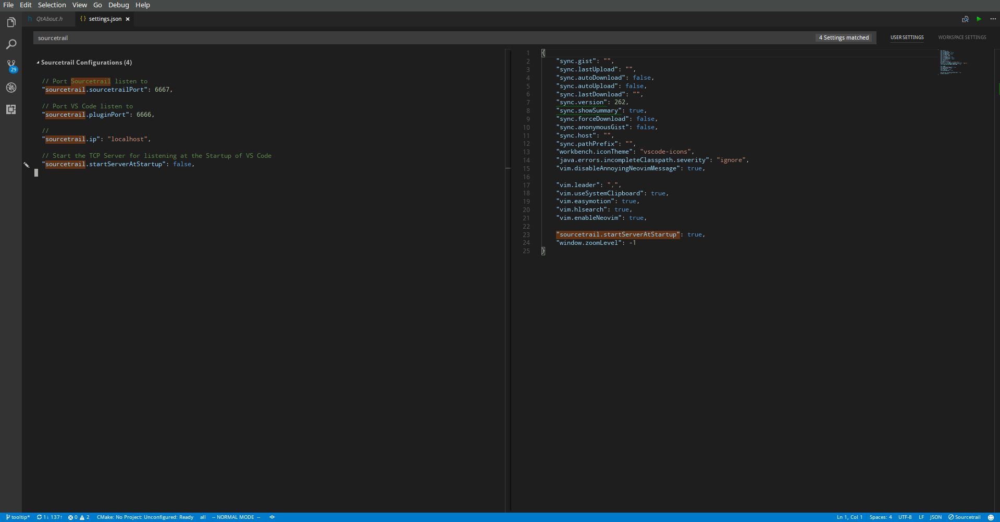
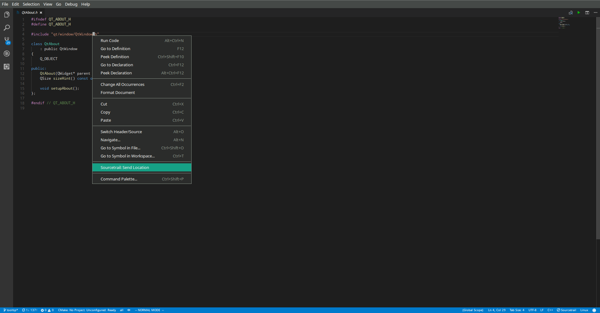
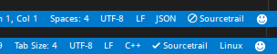

# sourcetrail extenstion

This extension enables VS Code to communicate with [Sourcetrail](http://sourcetrail.com)

The source code of this extension is available on [Github repo](http://github.com/CoatiSoftware/vsce-sourcetrail.git), feel
free to send a pull request or issue a bug.

## Features

> Settings for the Plugin

> Send Location from VS Code to Sourcetrail via context menu

> Display if the plugin is connected to Sourcetrail. Sourcetrail will be displayed if the TCP Server is running.

## Requirements

Plugin and Sourcetrail should be able to communicate over TCP

## Extension Settings

This extension contributes the following settings:

* `sourcetrail.pluginPort`: port VS Code listens to
* `sourcetrail.sourcetrailPort`: port Sourcetrail listens to
* `sourcetrail.ip`: TCP server ip address
* `sourcetrail.startServerAtStartup`: set to `true` to start the TCP listener at VS Code startup

## Known Issues

## Release Notes

### 0.1.0

Prototype
